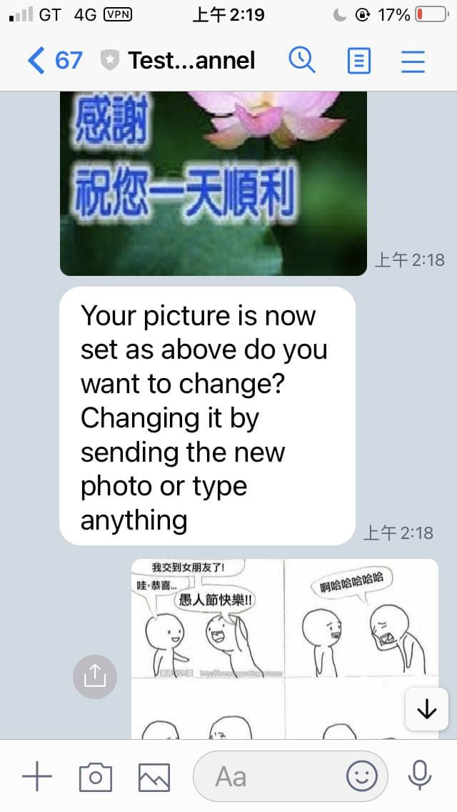
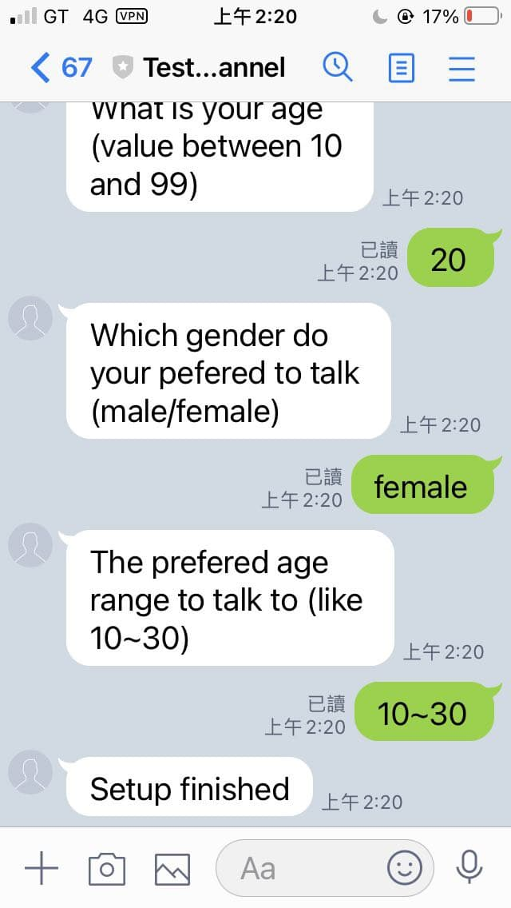

# Tineder: Dating App in Line

## 這是什麼
Tineder 是一個 line 機器人，無須註冊，只要你填寫你的基本資料（年齡，性別），還有聊天對象喜好（年齡範圍，性別）就可以快速在 line 上配對並且聊天。

## 有什麼功能

#### 修改自己在匿名聊天的基本資訊和偏好（用於配對）

##### 輸入名字且確認


##### 確認要設定的圖片


##### 設定完成


#### 配對使用者
待設定完成以後可以輸入 'HJack pair' 來進行配對，目前就只匹配雙方的性別跟聊天對象的性別是否合適


#### 解除配對使用者
如覺得不想繼續對話可以輸入 'HJack unpair' 來結束對話


## 啟動

### 環境
* Python 3.8.5
* MySQL 8.0.25 for Linux on x86_64 (MySQL Community Server - GPL)

### 安裝套件
```sh
pip install -r requirment.txt
```

### 修改設定檔
```python
# Tineder/config.py
line_bot_config = {
    "CHANNEL_ACCESS_TOKEN" : "", # 改成自己的 token
    "CHANNEL_SECRET" : "" # 改成自己的 secret
}
domain_rl = "" # 改成自己的 domain

mysql_url = "{drivername}://{user}:{passwd}@{host}:{port}/{db_name}?charset=utf8mb4".format(
    drivername="mysql+pymysql",
    user="root",
    passwd="root",
    host="localhost",
    port="3306",
    db_name="chatbot"
) # 改成自己的 mysql 連線資訊
```

### 執行
```sh
python app.py
```
